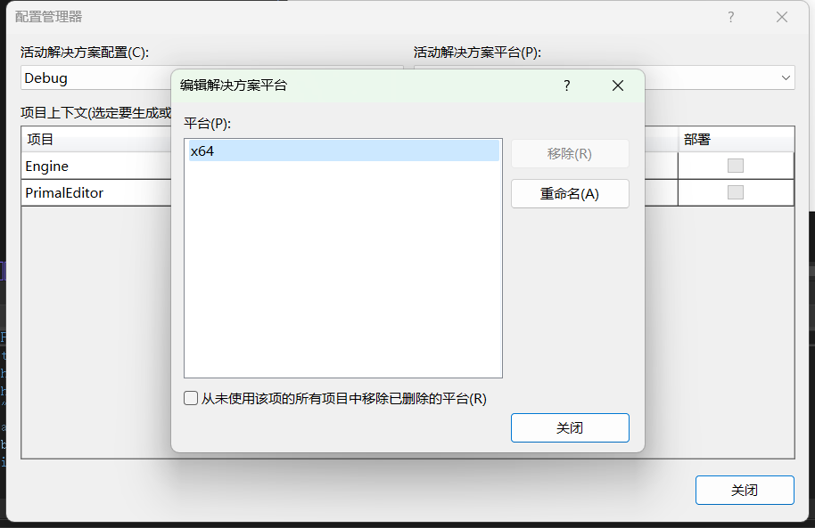
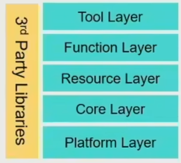

# 2023.11.29

scratch ？

wpf

引擎库(c++,x64)完全独立于关卡编辑器（c#,WPF）

color codes each episode 用颜色标记每一段代码

a bunch of 一堆

删除了不想支持的平台，解决方案做了什么？

通过"生成解决方案"，您可以一次性编译和构建整个解决方案中的所有项目，确保代码正确编译并生成所需的输出文件。

换个视频......

现代游戏引擎架构

SIMD