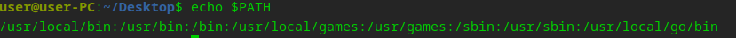

# 一、关于bash
## 1、命令
* 所有的命令都是可执行文件
* 每次在 Bash 里面输入一个命令时（比如 cd cp demo），Bash 都会去 PATH 目录里面寻找对应的文件，如果找到了就执行
## 2、环境变量
查看$PATH：

## 3、相关文件夹
* .bashrc
# 二、下载g++
```sudo apt-get install g++```
# 三、解压
```sudo tar -C /usr/local -xzf go1.21.2.linux-amd64.tar.gz```
