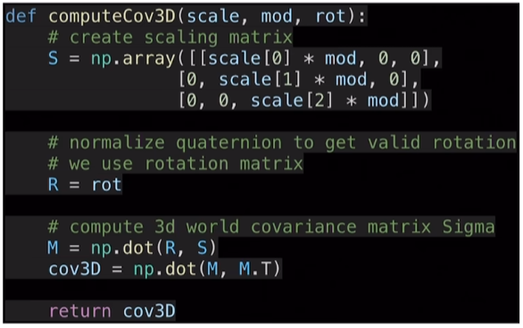
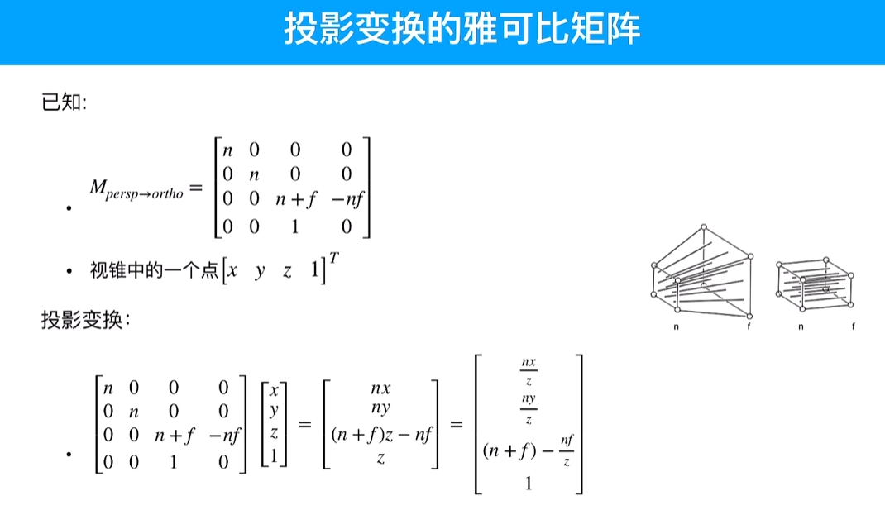

# Splatting算法

# 简化的参考代码

https://github.com/SY-007-Research/3dgs_render_python

# 一、捏雪球

## 高斯椭球

均值就是球核

### 为什么高斯是椭球

椭球是一个球面

这部分是一个[0 , n ]的值，因此这里是一个椭球：

### 协方差矩阵

## 各向同性和各向异性

## 协方差矩阵如何控制椭球形状

### 怎么求RS：特征值分解

$$
\Sigma=Q\land Q^T \\
\Sigma=Q\land^\frac{1}{2} \land^\frac{1}{2} Q^T
$$

### 没有使用四元数，根据RS求协方差矩阵

mod默认是1，应该是对缩放做一个系数

# 二、抛雪球

就是光栅化，nerf使用的是逆光栅化，应该和ray tracing是差不多的

## 观测变换

世界坐标系 => 相机坐标系，即MVP中的V

## 投影变换

## 视口变换

## 光栅化

## 高斯球的观测变换

## 高斯球的投影变换

- 由于透视投影是非线性的，可能会引起协方差矩阵的形变，所以引入雅可比矩阵（极小的区域是线性的）
- EWA splatting这篇文章有说明，因为投影变换不能保证3d高斯到像素平面还是高斯的，但是线性化了之后可以保证3d高斯投影后就是一个2d高斯

## 雅可比矩阵

## 3dgs的投影变换

这里的雅可比矩阵是根据**投影转正交矩阵**得到的

## 投影变换后

## 3dgs的视口变换

## 3dgs中心变换

- projmatrix已经做了观测变换
- p_proj做了归一化，这个点位于[-1,1]^3立方体（NDC空间）
- point_image做了视口变换

- 这里第一行与x相关使用focalx，第二行与y相关使用focaly，由于投影之后不考虑z方向，所以最后一行为0
- viewmatrix[:3,:3]取了一个3*3的矩阵，【旋转 缩放】矩阵
- 在球核做雅可比，用它的局部线性做为仿射变换
- 高斯分布进行仿射变换时，需要左右同乘【旋转 缩放】矩阵；在透视投影到正交投影的变换过程中， 雅可比矩阵扮演了这个【旋转 缩放】矩阵的角色

# 三、雪球颜色

## 球谐函数

- 注意他和球无关，他表达的是各个方向上是什么颜色（颜色空间）
- 球谐函数用到3阶（0~3）

- 一共是16个系数c,c是三维的，所以sh就是一个16*3的矩阵

- sh是16x3的矩阵，每一行都是1x3的颜色值，对应公式中的:
  $$
  C^0_0...C^3_3
  $$

- SH_C0...SH_C3对应公式中的y
- 在这里相机的位置就是球心，连接高斯球核得到一个方向，r被归一化为1

# 疑问：这里只表达了高斯椭球核的颜色吗？我觉得是

## 合成图片

### alpha混合

将每一个高斯的足迹图混合，3dgs用的是逐像素的求颜色，就要用到nerf的体渲染公式

- C是足迹图中记录的
- 概率密度已知

# 疑问：概率密度如何求得？

- 求T

## 体渲染

- T是在s处没有被阻挡的概率，sigma是在s处被阻挡的概率密度函数

- sigma和C都是已知的

## 3dgs快在哪

## 渲染代码

# 四、参数评估

- knn为的是铺满整个画面

