# 一、打包测试

避免素材有问题

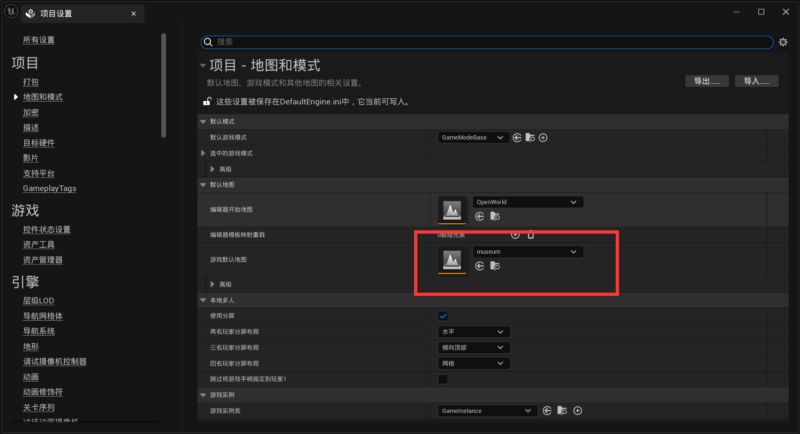

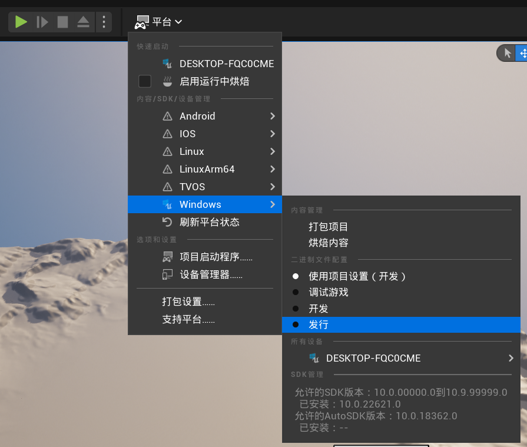

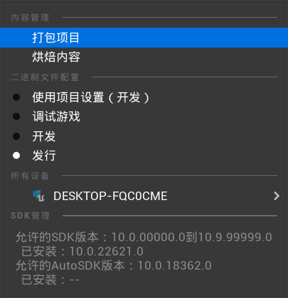

# 二、引入内容包

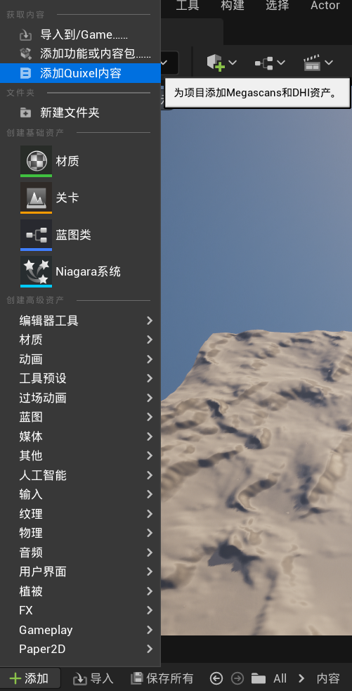

# 三、新建检测通道

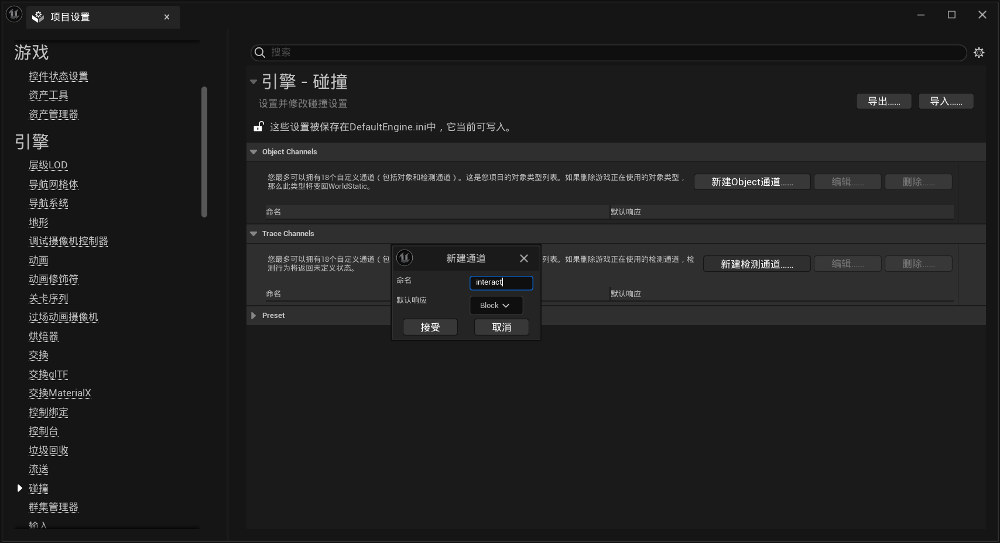

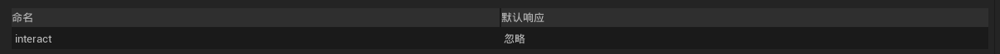

# 四、BP_Interact

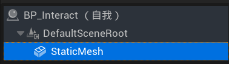

# 五、媒体播放器

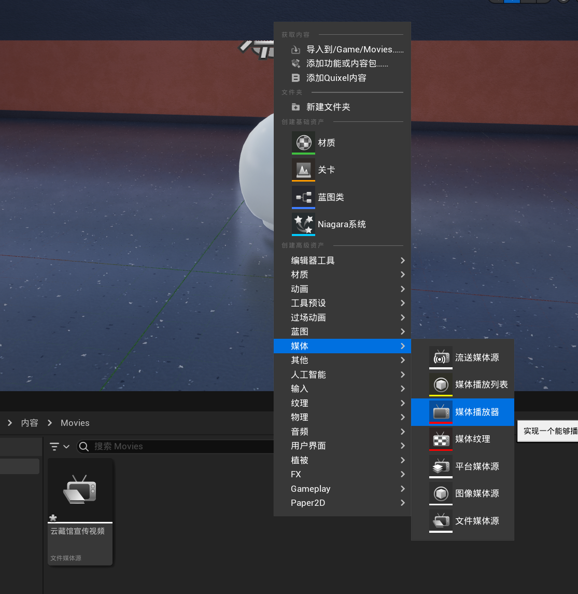

制作材质球

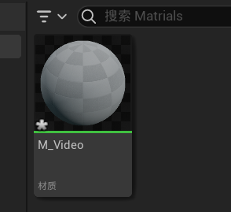

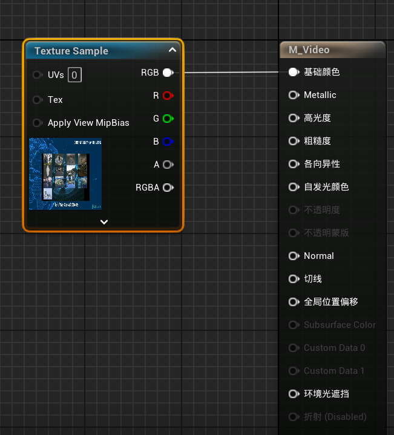

新建一个枚举类

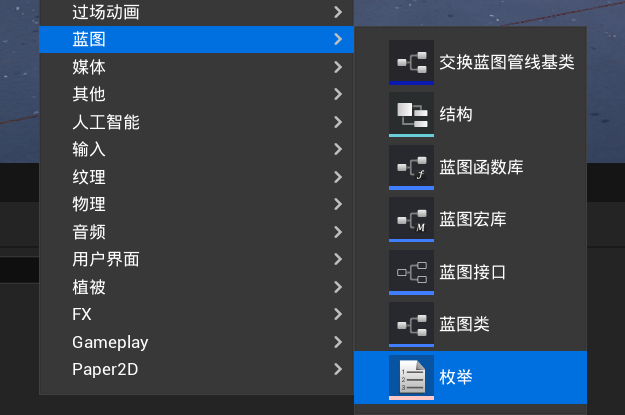

蓝图接口

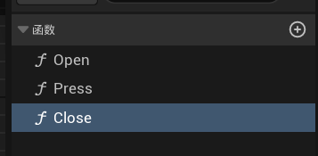

Interact中加入接口

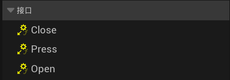 

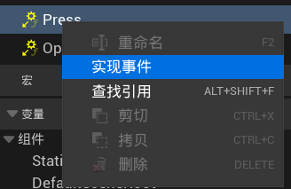

# 六、增强输入

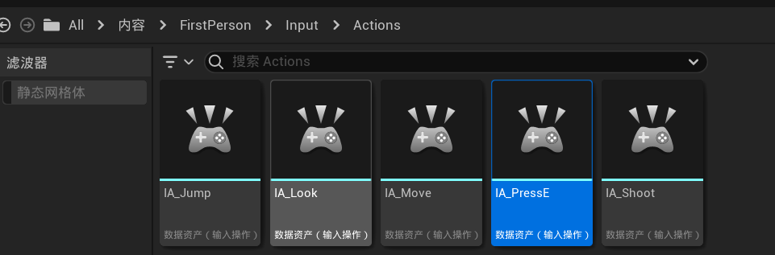

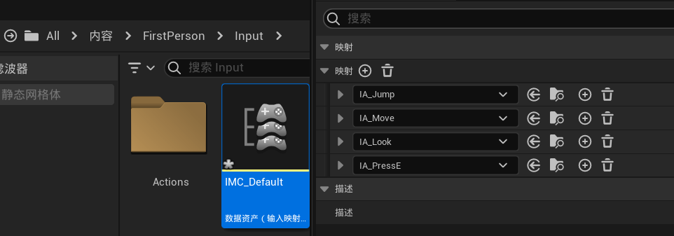

定义为按键E

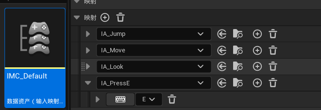

# 七、空间音效

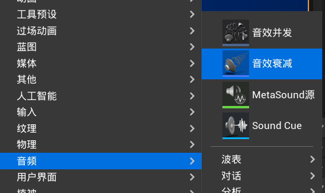

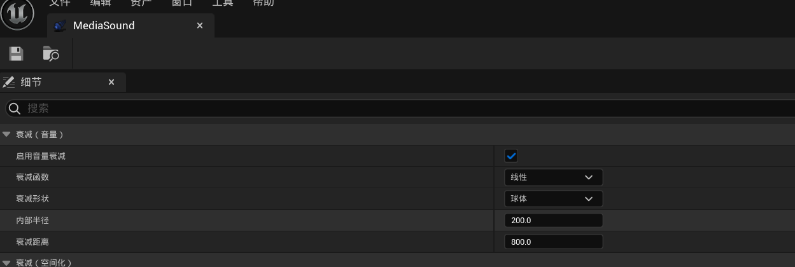

设置tv

# 八、看向物体时做出反馈

timeline

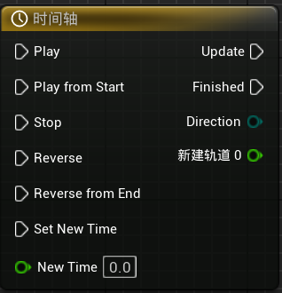

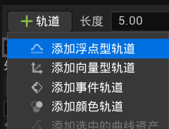

shift+鼠标左键添加关键帧

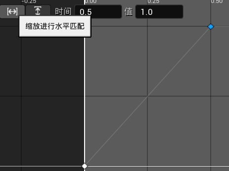

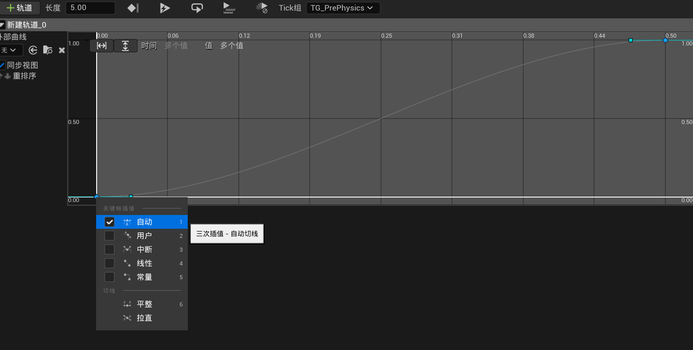

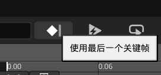

# 九、HUD 

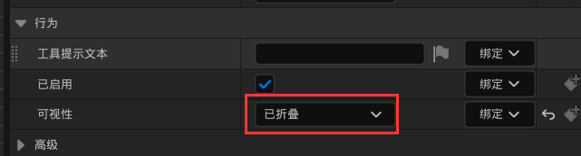 

纯类型函数是什么？