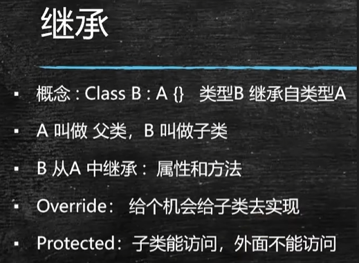
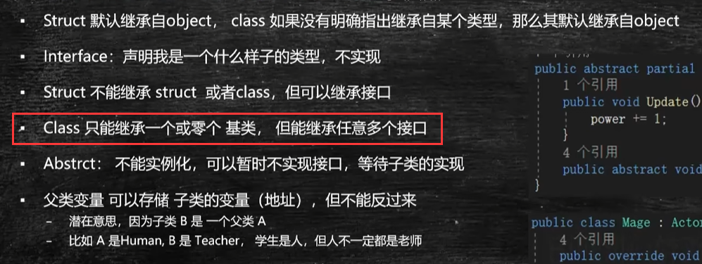
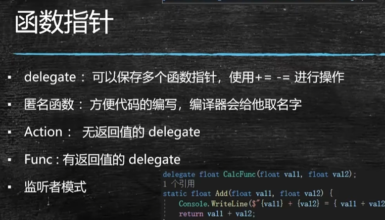

 

# 理解 C# 中的委托

在你的示例中，`GetLerpValue` 被用作平滑插值的源。因为这个方法是通过委托（或函数指针）传递的，实际上它可以被外部调用，而不需要创建该类的实例。这在某种程度上允许外部代码获取到类内部的私有字段，这个特性使得 C# 的委托在行为上与 C++ 中的友元类似。

# 抽象方法和虚方法

- 虚方法可以有方法体，可以不继承
- 抽象方法不能有方法体，一定要继承实现

# as和()转型

- `as` 关键字：如果转换失败，结果将是 `null`，而不会抛出异常。这使得 `as` 更加安全，尤其是在不确定对象类型时。

- `()` 转型：如果对象无法转换为指定类型，则会抛出 `InvalidCastException` 异常。