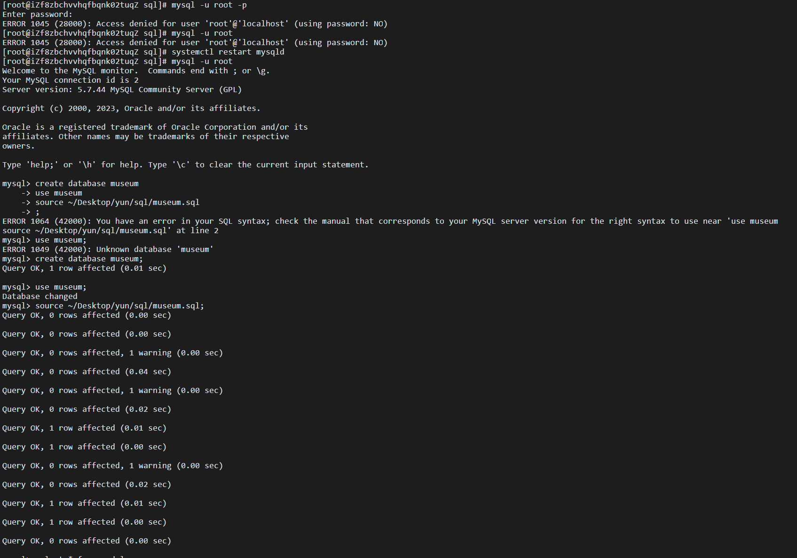

# Virtualbox挂载共享文件夹

```
// 挂载
sudo mount -t vboxsf games101 mnt/
// 关闭挂载
sudo umount -f folder/ 
```

# 安装mysql

https://blog.csdn.net/kzl_knight/article/details/104072189

## ERROR 1045 (28000): Access denied for user 'root'@'localhost' (using password: NO)

https://blog.csdn.net/m0_70556273/article/details/126490767

## 导入数据



# 安装图形界面

https://www.cnblogs.com/hellojesson/p/7699535.html

# 常用命令

## 显示隐藏文件

```bash
ls -a
```