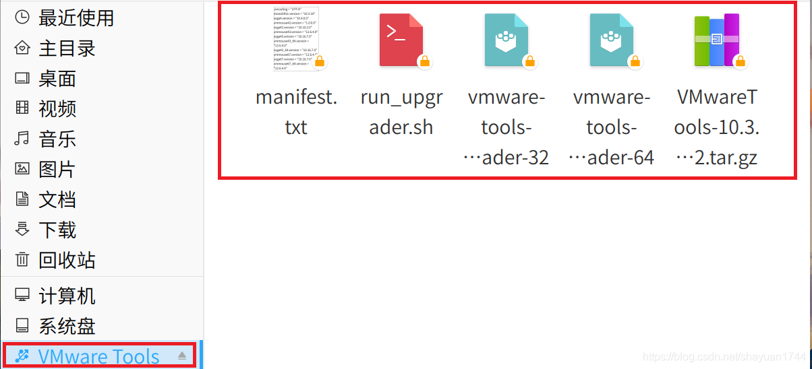
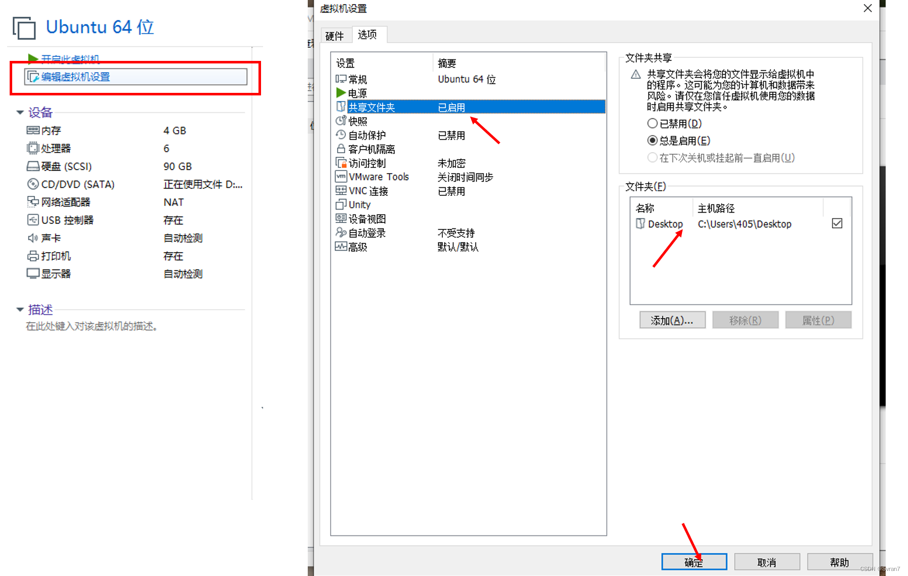
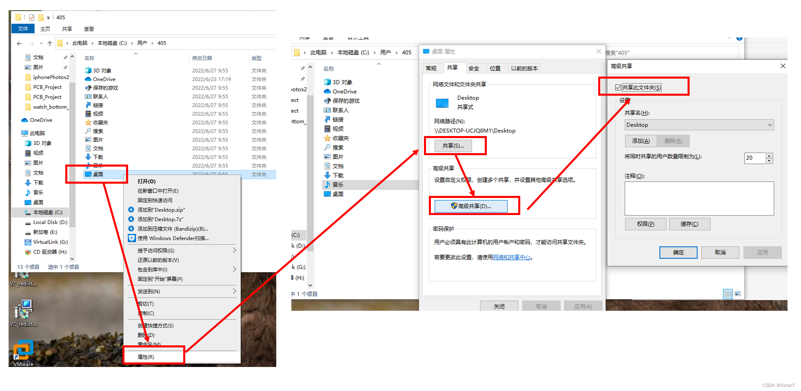

# 一、vm-tool安装
## 1、点击安装

## 2、将文件夹的内容复制到桌面

## 3、 将文件中的压缩包解压至当前文件夹，同时根据自己电脑系统的参数将vmware-tools-upgrader-32或vmware-tools-upgrader-64移入解压的文件夹vmware-tools-distrib
## 3、执行指令：sudo ./vmware-install.pl
## 4、全部默认enter

# 二、配置共享文件夹（共享桌面文件夹）
## 1、配置虚拟机

## 2、配置主机
