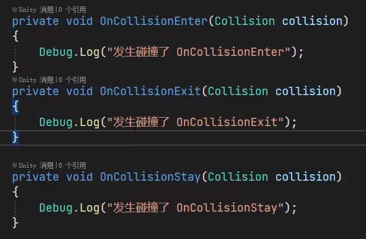
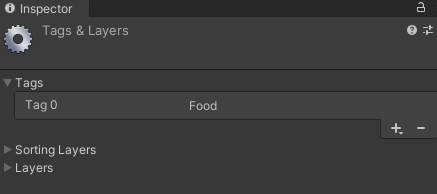

# demo：吃掉食物
## 1、为食物的prefab设置标签


```
 private void OnCollisionEnter(Collision collision)
 {
     Debug.Log("碰撞了");
    //collision.collider.tag == "Food"
     if (collision.gameObject.tag == "Food")
     {
         Destroy(collision.gameObject);
     }
 }
 ```