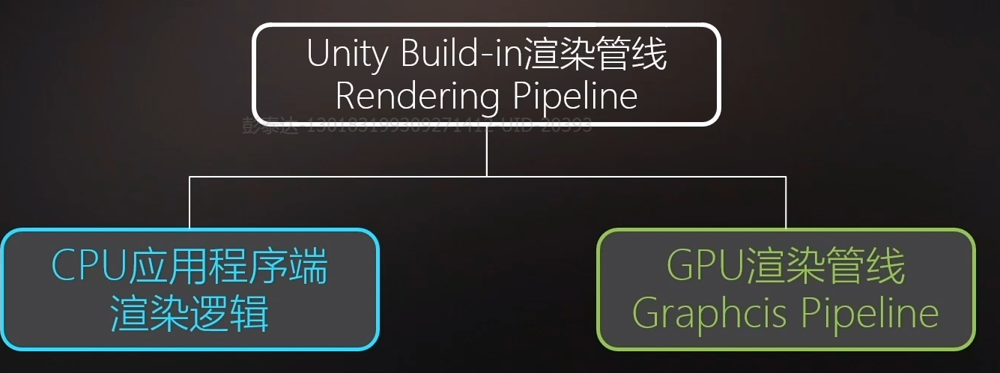
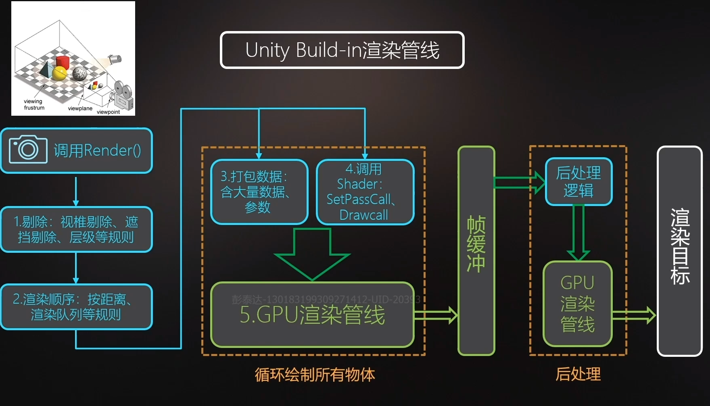
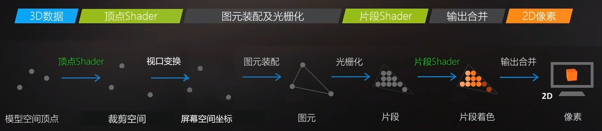
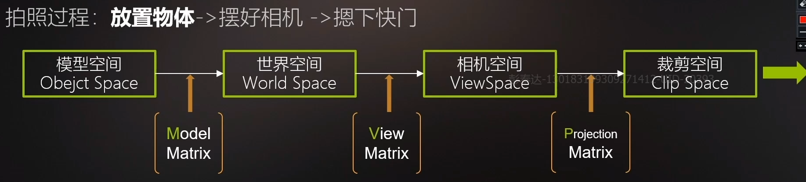
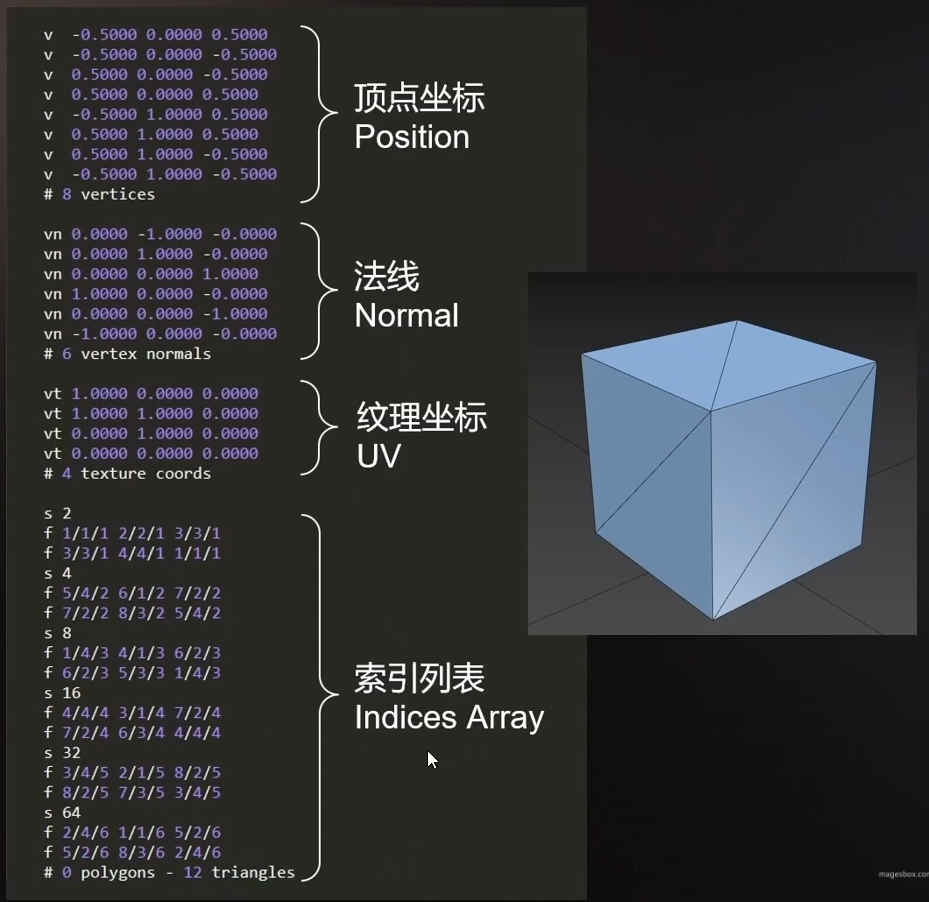

# 一、渲染管线

## unity渲染管线组成

## 渲染流程

## 渲染管线

## ”拍照“过程

模型空间 => 世界空间
$$
世界空间的基为：E=(e1,e2,e3); 设模型空间的基为 A=(a1,a2,a3) \\
\forall \alpha\in  \mathbb{R}^3 ，\beta_1 = (x_1,y_1,z_1),\beta_2 = (x_2,y_2,z_2) 分别为\alpha在物体空间和世界空间的坐标\\
都有：\alpha=(e1,e2,e3)(x_2,y_2,z_2)^T=(a1,a2,a3)(x_1,y_1,z_1)^T\\
即：(x_2,y_2,z_2)^T=A(x_1,y_1,z_1)^T
\\
基A的位置就描述了物体在世界坐标系下的位置，例如物体在原点时A =  \begin{bmatrix}
1 & 0 & 0 \\
0 & 1 & 0 \\
0 & 0 & 1
\end{bmatrix} 
\\
A即ModelMatrix\\
而ModelMatrix又包括R,S,T 都可以由A推出
$$

# 二、模型数据

