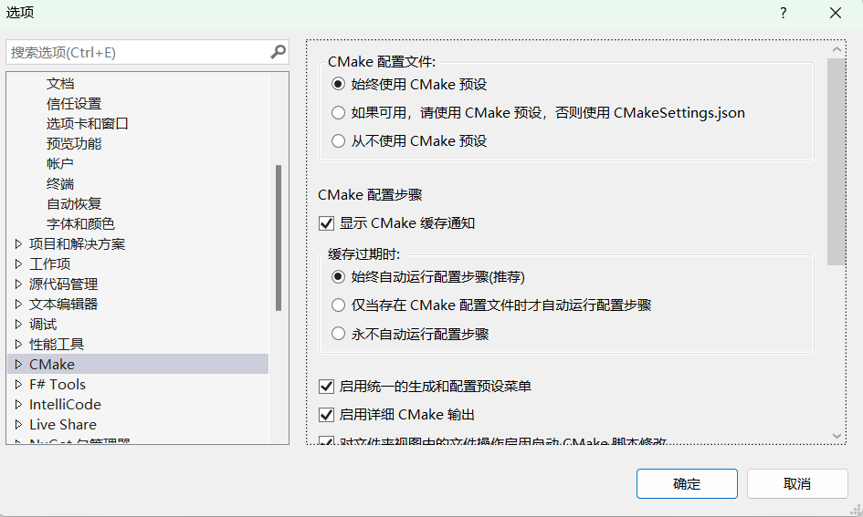

# vscode配置cmake

## MinGW

- [x86_64-win32-sjlj](https://sourceforge.net/projects/mingw-w64/files/Toolchains targetting Win64/Personal Builds/mingw-builds/8.1.0/threads-win32/sjlj/x86_64-8.1.0-release-win32-sjlj-rt_v6-rev0.7z)

## cmake预设

## 更便捷的写代码

## 设置生成的相对路径

