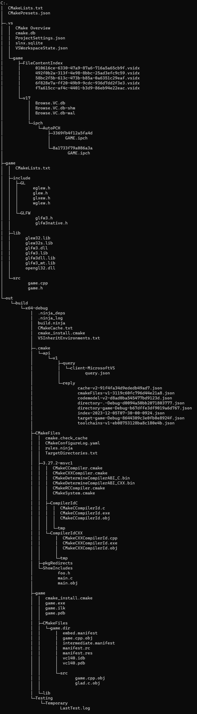
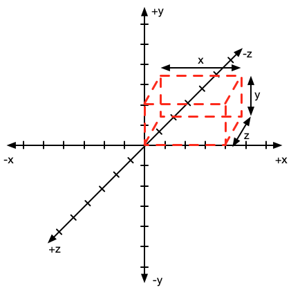
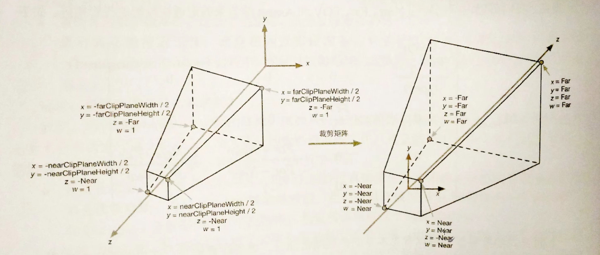
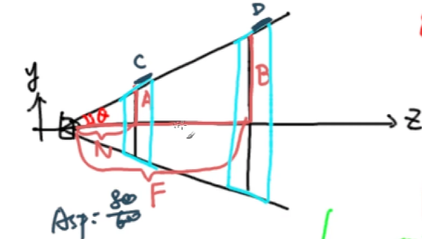
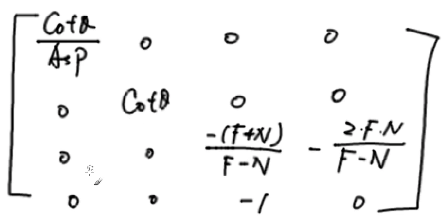
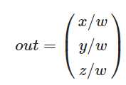

# OpenGL

## 一、手动安装

- cmake

- https://glew.sourceforge.net/

- https://www.glfw.org/download.html

- **opengl32.lib**在C:\Windows\System32下，但是没必要特地引入，用find_package()找

- 学习文档https://learnopengl.com/

- 目录结构

  

## 二、Nuget在线安装（未尝试）

## 三、opengl的坐标（右手系）



## 四、坐标系统


### 1、透视投影（PROJECTION MATRIX）

- 近面和远面可以确定一个平截头体(裁剪空间)
- 默认情况下两个面是一样大的，于是没有立体感
- 因此要变化两个面的大小（设置近面0.1f，远面100f）



**目标：从左图变换到右图**


$$
ASP=800/600
$$

$$
seita=FOV/2
$$

由已知的ASP和seita得到：
$$
C=A*ASP
$$

$$
D=B*ASP
$$

$$
A=N*tan(seita)
$$

$$
B=F*tan(seita)
$$

最终：
$$
A'= N = A*cot(seita)
$$

$$
B'= F = B*cot(seita)
$$

$$
C'= N = B*cot(seita) = C/ASP * cot(seita)
$$

$$
D'= F = B*cot(seita) = D/ASP * cot(seita)
$$

C、D是x轴的缩放，A、B是y轴的缩放，如缩放前y与缩放后y'之比：
$$
y'/y=B'/B = cot(seita)
$$
可知对于任意的y都有：
$$
y'=y*cot(seita)
$$
同理：
$$
x'=x*cot(seita)/ASP
$$
最后求z轴的变换，显然z轴的变换是线性的，设T(z):
$$
T(z) = kx+b
$$
由已知：
$$
T(N)=-N
$$

$$
T(F)=F
$$

得到：
$$
k=-(F+N)/(F-N)
$$

$$
b=-2FN/(F-N)
$$

k和b事实上是z轴缩放加位移变换，所以接下来的变换矩阵可以看作是两个矩阵的相乘，此外w存储了原来的z值，最终变换矩阵如下：



一般而言，w=1.0f，这里最后一个行向量(0 0 -1 0)是为了修改w为原来z的值

离观察者越远的顶点坐标w分量越大，最终每个坐标的xyz都会除以w，从而越远的物体坐标越紧凑（近大远小）



至于-1是unity为了将左右系转右手系。

**从中也可以发现变换矩阵一定是方阵**

## 怎么利用一条drawarray画10个图形？

## 坐标变换

坐标变换要遵守trs的顺序

如shader中：

```shader
projMat *  viewMat * modelMat * vec4(aPos, w);
```

modelMat可能有：
$$
modelMat=translate*rotate*scale
$$
