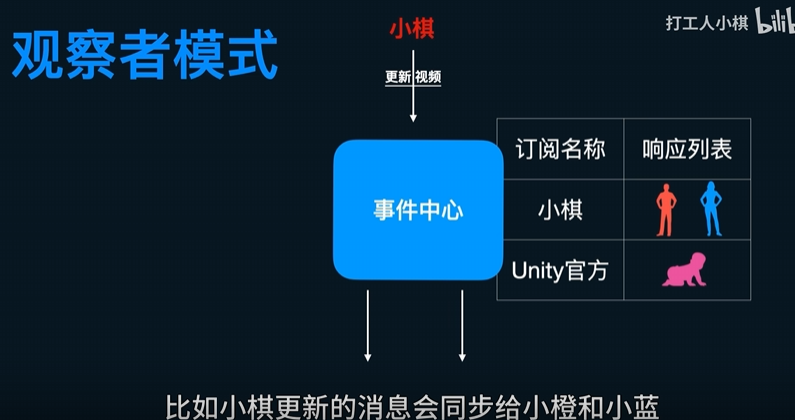

# 原理



# Code

```c#
using System.Collections;
using System.Collections.Generic;
using UnityEngine.Events;
using UnityEngine;

public class EventCenter
{
    private static EventCenter instance;

    // 存储所有事件
    private Dictionary<string, IEventInfo> _eventDic = new Dictionary<string, IEventInfo>(); 
    public static EventCenter Instance
    {
        get
        {
            if(instance == null)
            {
                instance = new EventCenter();
            }
            return instance;
        }
    }
    public void AddEventListener<T>(string name,UnityAction<T> action)
    {
        if(_eventDic.ContainsKey(name))
        {
            (_eventDic[name] as EventInfo<T>).actions += action;
        }
        else
        {
            _eventDic.Add(name, new EventInfo<T>(action));
        }
    }

    public void RemoveEventListener<T>(string name,UnityAction<T> action)
    {
        if (_eventDic.ContainsKey(name))
            (_eventDic[name] as EventInfo<T>).actions -= action;

    }

    public void EventTrigger<T>(string name,T info)
    {
        if(_eventDic.ContainsKey(name))
        {
            if((_eventDic[name] as EventInfo<T>).actions != null)
            {
                (_eventDic[name] as EventInfo<T>).actions.Invoke(info);
            }
        }
    }
}

public interface IEventInfo
{

}

public class EventInfo<T> : IEventInfo
{
    public UnityAction<T> actions;
    public EventInfo(UnityAction<T> action)
    {
        actions += action;
    }
}
```

