# 用例图

- 包含

  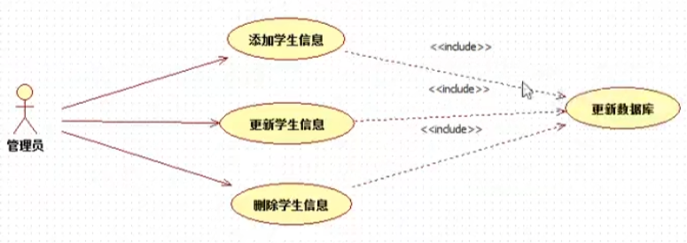

- 泛化

  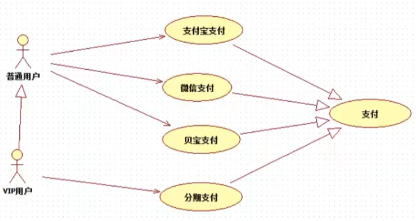

- 关联

- 扩展（if）

  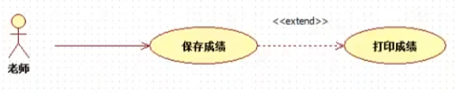

# 类图

- 泛化

  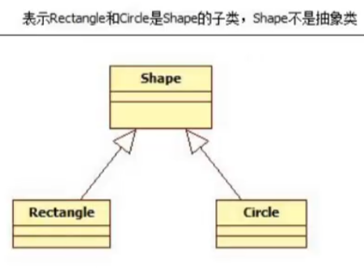

- 关联

  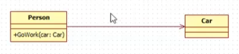

  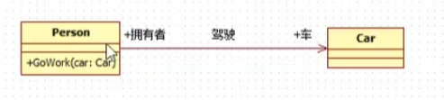

  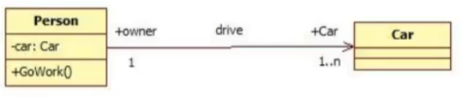

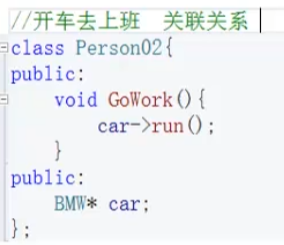

- 依赖

  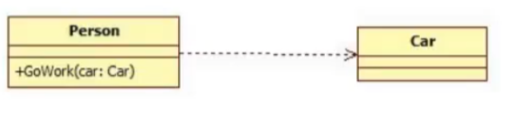

  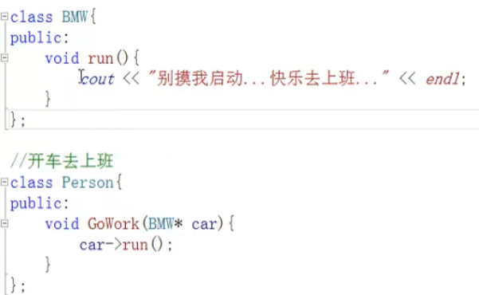

- 实现

  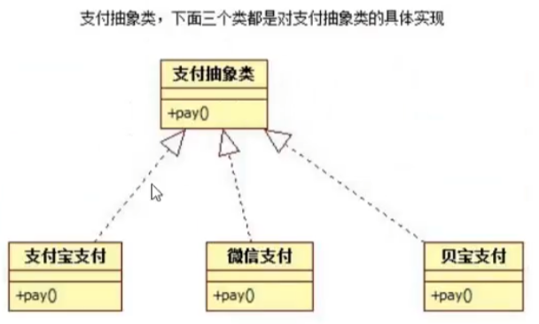

- 聚合（整体与部分，强关联）

  互不分离

- 组合

  部分不能脱离整体单独存在


# 1、访问者模式

在不修改已有类的情况下，增加新的操作角色和职责

# 2、单例模式

## 2.1、构造函数私有化

- 移动构造函数：资源的转移，不产生新的对象实例
- 拷贝：能够得到新的对象实例
- 不带参：能够得到新的对象实例

单例模型要在根源上保证只能够产生一个对象实例，因此**拷贝和不带参**构造函数都要“绝育” 

1、修改权限

```c++
private:
        TaskQueue() = default;
        TaskQueue(const TaskQueue& t) = default;
		TaskQueue& operator=(const TaskQueue& t) = default;
```

2、delete

```c++
public:
        TaskQueue() = delete;
        TaskQueue(const TaskQueue& t) = delete;
		TaskQueue& operator=(const TaskQueue& t) = default;
```

## 2.2、完整代码

只能通过类名访问静态函数，而静态函数只能访问静态成员

- 静态函数
- 静态私有类指针成员

### 2.3.1、饿汉模式

对象在main函数执行前就已经创建

```c++
#include <iostream>

class TaskQueue
{
    public:
        TaskQueue(const TaskQueue& t) = delete;
        TaskQueue& operator=(const TaskQueue& t) = delete;

        static TaskQueue* getInstance()
        {
            return instance;
        }

        void print()
        {
            std::cout << "hello world" << std::endl;
        }
    private:
        TaskQueue() = default;
        static TaskQueue* instance;
};
// 初始化单例
TaskQueue* TaskQueue::instance = new TaskQueue;
// 静态成员在外部初始化是语法要求，但初始化实质算在作用域内操作，所以才能访问私有的构造函数

int main()
{
    TaskQueue* taskQ = TaskQueue::getInstance();
    taskQ->print();
}
```

### 2.3.2、懒汉模式

第一次使用到时才初始化

```c++
class Singleton_lazy{
    public:
        Singleton_lazy(const Singleton_lazy& t) = delete;
        Singleton_lazy& operator=(const Singleton_lazy& t) = delete;
        static Singleton_lazy* getInstance(){
            if(instance == nullptr){
                instance = new Singleton_lazy();
            }
            return instance;
        }
    private:
        Singleton_lazy() = default;
        static Singleton_lazy* instance;
};
Singleton_lazy* Singleton_lazy::instance = NULL;
```

